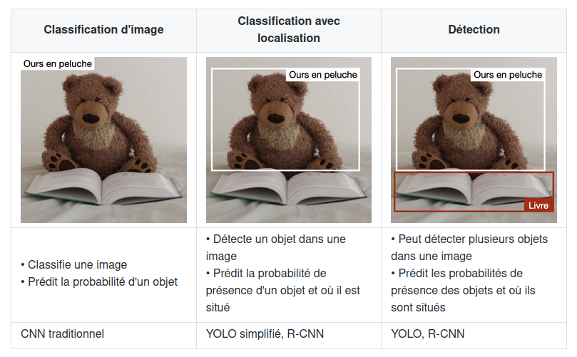
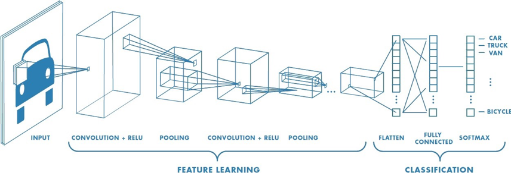
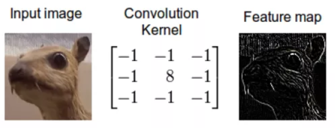

Contenu des interactions en utilisant la vision artificielle
============================================================

Maintenant qu'il a été démontré des techniques permettant à un robot de
service de naviguer socialement et d'initier des interactions, il est
nécessaire de proposer du contenu lors de ces interactions. Dans le
cadre du projet Reachy mobile, il a été décidé de faire jouer le robot
au tictactoe (soit morpion) et au chifoumi (pierre feuille ciseaux) car
ces jeux sont ludiques et peuvent divertir un large public. La
compréhension du jeu pour le robot se base sur des algorithmes de
vision, et notamment de reconnaissances d'objets. Pour le tictactoe, il
est nécessaire de pouvoir reconnaitre des cubes et des cylindres afin de
déterminer la stratégie de jeu. Pour le jeu du chifoumi, il est
nécessaire de détecter si le geste de la main est une pierre, une
feuille ou un ciseaux.

Méthodes pour la détection d'objets (*machine learning*)
--------------------------------------------------------

Les deux jeux nécessitent de mettre en place des méthodes pour la
détection d'objets, deux approches co-existent pour ce problème, le
traitement d'image \"classique\" et le *machine learning*, comme le
précise [@zhao_object_2019], les modèles de *machine learning*
permettent d'apprendre des caractéristiques sémantiques et *in fine*
sont adaptés pour le problème de détection par leur capacité
d'adaptabilité aux différentes conditions et leur lien avec la
sémantique de l'objet. Les modèles de Machine Learning sont classés en
trois grandes catégories : supervisé, non supervisé et apprentissage par
renforcement. Si le modèle est un modèle supervisé, il peut être de 2
types ou sous-catégories : modèle de régression ou de classification.

**L'apprentissage supervisé** consiste à apprendre à une fonction à
faire correspondre une entrée à une sortie en se basant sur des exemples
connus (des paires entrée-sortie). Par exemple, si un ensemble de
données avec deux variables est à disposition, l'âge (en entrée) et la
taille (en sortie), il serait possible de mettre en œuvre un modèle
d'apprentissage supervisé pour prédire la taille d'une personne en
fonction de son âge. **Les algorithmes dits non supervisés** ne sont pas
entraînés par les *data scientist*. Ils dépendent de méthodes
d'apprentissage approfondie pour identifier des *patterns* en passant au
peigne fin des ensembles de données d'entraînement non étiquetées, puis
en observant les corrélations. Les modèles entraînés avec cette méthode
ne sont pas dirigés pour trouver un résultat ou identifier des données
en particulier. **L'apprentissage par renforcement** est un modèle
d'apprentissage comportemental. L'algorithme reçoit un *feedback* de
l'analyse des données et guide l'utilisateur vers le meilleur résultat.
L'apprentissage par renforcement diffère des autres types
d'apprentissage supervisé, car le système n'est pas formé avec un
ensemble de données exemple. Au lieu de cela, le système apprend plutôt
par le biais d'une méthode d'essais et d'erreurs. Par conséquent, une
séquence de décisions fructueuses aboutit au renforcement du processus,
car c'est lui qui résout le plus efficacement le problème posé.

Pour choisir une méthode de *machine learning* il faut comprendre et
savoir pourquoi choisir une méthode plutôt qu'une autre : Le problème
est-il récurrent et défini ? Ou bien, l'algorithme devra-t-il prédire de
nouveaux problèmes ? Si l'algorithme doit prédire de nouveaux problèmes
il faudra se pencher vers un modèle non supervisé, si l'algorithme doit
prédire un problème récurrent et connu il sera conseillé d'utiliser des
modèles d'apprentissage supervisés. Le problème de l'apprentissage
supervisé est que le temps de mise en place, la création du jeu de
données, l'étiquetage de chaque données est fastidieux et long à
effectuer. A contrario, un modèle d'apprentissage non supervisé ne
nécessite pas toutes ces étapes. Pour ce qui est des modèles non
supervisés l'algorithme lui-même ne peut pas \"inventer\" ce qu'est un
visage, mais il peut essayer de regrouper les données en différents
groupes, par exemple, il peut distinguer que les visages sont très
différents des paysages, qui sont très différents des chevaux. Le choix
d'un modèle ou d'un autre dépend entièrement de la problématique du
sujet [@zhao_object_2019].

Selon la terminologie usuelle il est possible distinguer la détection,
de la localisation et de la reconnaissance d'objets [@liu_deep_2019]
comme décrit dans la :

-   **détection (ou classification)** : présence d'une instance de
    l'objet dans l'image. La détection se fait sur les objets dit
    générique comme une voiture par exemple.

-   **reconnaissance** : identification d'une instance spécifique (« Le
    chien du voisin », « le visage de Donald Trump »\...)

-   **localisation** : situation spatiale précise de l'instance
    (détectée ou reconnue) dans l'image (cadre englobant ou segmentation
    de la zone)\

\

### Classification

La classification consiste à reconnaître à quelle catégorie appartient
une image parmi un ensemble de catégories prédéterminées. Toutes les
données auront obligatoirement une seule classe. Il existe différents
algorithmes de classification comme les méthodes hiérarchiques, le
partitionnement (*$k$-means*) ou les méthodes probabilistes
(*Expectation-Maximization algorithm*) et bien d'autres encore. Parmi
ces algorithmes de classification il est possible de trouver, pour les
plus connus:

-   La méthode des $k$ plus proches voisins

-   Le classifieur bayésien

-   La méthode du Support *Vector Machines* (SVM)

Mais aussi plein d'autres algorithmes comme l'arbre de décision, la
régression logistique, le *bagging*, le *boosting* et bien d'autres qui
sont présenté dans l'article de [@talon_analyse_2018].

Comme le théorème *No Free Lunch Theorem* l'explique, en l'absence de
connaissances spécifiques sur le problème, il n'y a pas de méthode de
classification fondamentalement meilleure qu'une autre, autrement dit :
sur une infinité de problèmes de classification, en moyenne toutes les
méthodes sont équivalentes [@wolpert_no_1997].

### Localisation

La localisation d'objet consiste à localiser une instance d'une
catégorie d'objet particulière dans une image, généralement en
spécifiant une zone de délimitation étroitement rognée centrée sur
l'instance. La détection d'objets, au contraire, est la tâche de
localiser toutes les instances possibles de tous les objets cibles. La
localisation d'objets est également appelée « classification avec
localisation ». En effet, l'architecture qui effectue la classification
d'image peut être légèrement modifiée pour prédire les coordonnées de la
boîte englobante [@liu_deep_2019]. Les réseaux de neurones profonds
permettent de faire de la détection avec localisation de l'objet par
différentes méthodes comme la segmentation sémantique, la segmentation
d'instance d'objet ou la détection d'objet générique avec boites
englobantes comme montrer sur la .

### Deep Learning

Parmi les techniques de *machine learning* (ou apprentissage profond),
il est possible de trouver les réseaux de neurones artificiels ici, la
machine est capable d'apprendre par elle-même, contrairement aux autres
modèles de *machine learning* vu auparavant qui se contentent d'exécuter
à la lettre des règles prédéterminées. Les réseaux de neurones
artificiels sont inspirés par les neurones du cerveau humain. Ils sont
composés de dizaines, voire de centaines de « couches » de neurones,
chacune recevant et interprétant les informations de la couche
précédente. Plus le nombre de neurones est élevé, plus le réseau est dit
« profond ». L'apprentissage en profondeur (*Deep Learning*) permet aux
modèles informatiques d'apprendre des représentations complexes,
subtiles et abstraites, entraînant des progrès significatifs dans un
large éventail de problèmes tels que la reconnaissance visuelle, la
détection d'objets, la reconnaissance vocale, le traitement du langage
naturel, l'analyse d'images médicales et la découverte de médicaments.

Dans une version élémentaire, chaque neurone $i$ d'un tel réseau possède
un niveau d'activation $x_i$ compris entre $0$ et $1$. Le schéma
d'interconnexion entre neurones définit l'architecture du réseau. Une
architecture classique consiste à organiser les neurones en couches
successives avec des interconnexions limitées aux couches adjacentes
comme le montre la .

Le nombre d'articles sur la détection d'objets basée sur l'apprentissage
avec réseaux de neurones profond est époustouflant. Il y en a tellement,
en fait, que la compilation d'un examen complet de l'état de l'art
dépasse le cadre d'un document de longueur raisonnable. Dans le cadre du
projet Reachy Mobile, il a été récupéré un travail déjà commencé sur le
jeu du tictactoe, déjà
[documenté](https://github.com/ta18/reachy-tictactoe_2021). Dans ce
projet, c'est le *deep learning* qui est utilisé pour détecter les
pièces et cases vides. Il convient donc s'intéresser aux réseaux de
neurones profonds et plus précisément aux réseaux convolutifs. Trois
principaux types d'algorithmes de reconnaissance d'objet existent, pour
lesquels la nature de ce qui est prédit est différent. Ils sont décrits
dans la .

Les réseaux R-CNN sont des réseaux qui contiennent des couches de
neurones convolutionnels (*Region with Convolutional Neural Networks*,
R-CNN). Les réseaux R-CNN sont des algorithmes de détection d'objet qui
segmentent l'image d'entrée pour trouver des zones délimitantes
pertinentes, puis appliquent un algorithme de classification pour
trouver les objets les plus probables d'apparaître dans ces zones.

Le réseaux de neurones *mobilNet* fait partie de la famille des réseaux
de neurones convolutionnel (*Convolution Neural Network* ou CNN). Comme
décris sur la , un CNN est composé de plusieurs couches, comprenant la
convolution, le *ReLU*, le *Pooling*, le *Flattening*, et la *Full
connection* [@noauthor_cs_nodate].

Afin de déterminer le contenu de l'image, les réseaux CNN passent par
deux phases :

-   La phase de *Feature Learning*, composée de plusieurs convolutions
    successives. A pour but de faire sortir certaines caractéristiques
    de l'image.

-   La phase de Classification, prédisant si l'image en entrée est une
    voiture, un camion, un vélo, etc.

La convolution consiste à appliquer un filtre sur l'image. Pour cela un
kernel se déplace sur la totalité de l'image d'entrée et agit comme un
filtre afin de produire une image en sortie. Le kernel a pour but de
détecter des formes particulières. Il est possible d'obtenir le résultat
sur la .

Dans *MobileNet*, la convolution est remplacée par une *Depthwise
Separable Convolution*. Celle-ci se compose de 2 étapes : le *Depthwise
Convolution* et la *Pointwise Convolution*. L'architecture des
*MobileNets* est une architecture composée de 28 couches dont 13
*Depthwise Convolution* et 13 *Pointwise Convolution*

Les réseaux MobilNet-V2 et Mobilnet-V3 obtiennent de meilleures
performances qu'un réseau Mask R-CNN,qui est le réseau généralement
utilisé pour la détection d'objet. La séparation de la convolution en
deux temps permet une économie de calculs, un allègement de la mémoire.
Ces optimisations ont également un bénéfice sur le temps de réponse et
sur la consommation énergétique, tout en ayant un faible impact sur la
précision, rendant son utilisation adaptée aux systèmes embarqués
[@howard_mobilenets_2017].

Amélioration des performances d'un réseau de neurones profonds
--------------------------------------------------------------

Il y une chose à étudier dans l'évaluation des modèles, ou plutôt un
élément à surtout éviter : l'*overfitting*.

Il peut tout à fait y avoir des modèles qui sont très bons dans la
prédiction de jeux de données d'entraînement, mais qui obtient des moins
bonnes prédictions pour le jeu de test. Cela veut dire que le réseau de
neurones a sur-appris (*overfit*).

Par exemple, un élève qui révise ses leçons et qui les apprend par cœur
se trouve avoir comme résultat à l'évaluation un 2/20. Cela signifie
qu'il a bien trop appris la leçon dans le cadre de ce qui avait dans son
cours, mais qu'il n'a pas réussi à généraliser sur d'autres exercices.
Les modèles de *Machine Learning* possèdent le même défaut. Pour éviter
cela, plusieurs réglages peuvent être mis en place pour éviter
l'*overfitting* mais également améliorer les performances du réseau.

### Amélioration des performances avec les données

Un jeu de données d'apprentissage doit contenir un nombre suffisant
d'images annotées des catégories du sujet de classification étudié.
L'approche classique lors de la création du jeu de données, est
d'augmenter le jeu donné. Il existe plusieurs méthodes d'augmentation de
données, dont l'application de transformations géométriques comme le
recadrage, le changement d'échelle, la rotation, l'effet miroir et
d'autres sur les images du jeu de données d'apprentissage qui permettent
de créer ou de redimensionner de nouvelles données
[@daou_amelioration_nodate]. Cette approche permet au modèle CNN
d'apprendre des caractéristiques d'images plus diversifiées et par suite
pouvoir prédire correctement la catégorie de l'image capturée. Par
exemple, avec les données d'images photographiques, vous pouvez obtenir
de meilleures performances en déplaçant et en faisant pivoter de manière
aléatoire des images existantes. Cette méthode d'augmentation du jeu de
données permet que lorsqu'une augmentation de données est effectué sur
une image de test (par exemple, une rotation de sa position normale ou
un changement d'échelle) le système de localisation sache s'adapter au
changement, et que finalement il soit plus apte à reconnaître
correctement l'objet.

Il existe plusieurs méthodes de partitionnement du jeu de donnée en
paquet de d'entraînement et de test comme la méthode du *Hold-out*
consiste à diviser l'ensemble de données en deux parties : comme
expliqué sur la , l'ensemble d'apprentissage et l'ensemble de test. En
général, 80 pourcent de l'ensemble de données est consacré à l'ensemble
d'apprentissage et 20 pourcent à l'ensemble de test. L'entraînement est
lancé sur l'ensemble d'entraînement et le modèle est validé sur
l'ensemble de test. La validation croisée *Hold-out* est la technique la
plus simple et la plus courante pour créer un jeu de donnée permettant
de bonnes performances [@noauthor_31_nodate].

Le problème avec la méthode du *Hold-out*, est que si le jeu de donnée
d'entraînement n'est pas représentatif du jeu de test, le réseau ne
pourra pas prédire sur des données ou il n'a pas était entraîné. En
raison de la variabilité de l'échantillon entre les ensembles de train
et de test, le modèle peut donner de meilleures prédictions sur les
données de train, mais ne parvient pas à généraliser sur les données de
test. Il existe d'autres méthodes de cross validation qui permettent de
partitionner le jeu de données de façon plus intelligente. La méthode du
*Leave-One-Out*, la méthode du *K-Fold* (comme montrer sur la cette
méthode consiste à découper le data set en k échantillons. On
sélectionne x échantillons pour constituer l'échantillon
d'apprentissage. Les k-x échantillons restants permettront d'évaluer la
performance du modèle. Pour construire le modèle suivant on sélectionne
les échantillons différemment de manière à ne jamais avoir les mêmes
échantillons d'apprentissage et de validation) ou encore la méthode du
*Stratified-K-Fold* [@noauthor_cross-validation_2020].

\

### Amélioration des performances grâce au réglage des algorithmes

\

Le *Grid search* est une méthode d'optimisation (*hyperparameter
optimization*) qui permet de tester une série de paramètres et de
comparer les performances pour en déduire le meilleur paramétrage
d'entraînement. Il existe plusieurs manières de tester les paramètres
d'un modèle et le *Grid Search* est une des méthodes les plus simples
[@noauthor_32_nodate]. Pour chaque paramètre, il est déterminé un
ensemble de valeurs à tester comme sur la . Le *Grid Search* croise
simplement chacune de ces hypothèses et va créer un modèle pour chaque
combinaison de paramètres. Puis, les différents modèles de paramétrage
doivent être testés avec des méthodes de validation croisées vu plus
haut. En règle générale, certains hyperparamètres tel que le *batch
size* le nombres d'époques ou le nombres de *steps* sont les premiers
paramètres à étudier pour améliorer les performances de l'entraînement.
Pour ce qui est du *batch size*, il est nécessaire de paramètrer par
rapport à la RAM du GPU de la machine sur lequel le réseau est entraîné.
Ainsi, plus la taille du *batch size* est grande, plus le nombre
d'échantillons propagés à travers le réseau de neurones est important.
Il est aussi important de regarder les courbes de *loss* qui permettent
de voir quand le réseaux est assez entraîné : par exemple, à partir de 9
000 *steps* le réseau peut être stabilisé, cependant au-delà on pourrait
observer de l'overfitting. Ces implémentations permettent une meilleure
précision. En contrepartie, elles prennent aussi beaucoup de temps à
l'entraînement et doivent être paramétrées correctement. En effet, elles
peuvent augmenter le risque de sur apprentissage. Tout est question
d'équilibre entre *batch size*, *epoch* et nombre de *steps*.

De plus, si un nombre insuffisant de neurones est utilisé dans
l'architecture du réseau, le réseau sera incapable de modéliser des
données complexes et l'ajustement résultant sera médiocre. Si trop de
neurones sont utilisés, le temps d'apprentissage peut devenir
excessivement long et, pire encore, le réseau peut sur-apprendre les
données. Lorsqu'un sur-apprentissage se produit, le réseau commence à
modéliser le bruit aléatoire dans les données. Le résultat est que le
modèle s'adapte extrêmement bien aux données d'apprentissage, mais qu'il
se généralise mal aux nouvelles données inédites.

Pour trouver la dimension optimale d'une couche cachée il est nécessaire
d'effectuer des essais, il n'est pas souhaitable d'avoir trop de
neurones, mais il doit y avoir suffisamment de neurones pour que le
réseau soit capable de capturer les complexités de la relation entrée et
sortie. D'après le Dr Heaton dans son livre *Introduction to Neural
Networks with Java* [@heaton_introduction_2008], trois règles empiriques
permettent de choisir la dimension d'une couche cachée :

-   Si le réseau n'a qu'un seul neurone de sortie et que la relation
    entrée et sortie est assez simple, la taille de la couche cachée est
    égale aux deux tiers de la dimension d'entrée.

-   Si le réseau à plusieurs neurones de sortie ou si la relation
    entrée/sortie est complexe, la dimension de la couche cachée égale à
    la dimension d'entrée plus la dimension de sortie (mais elle doit
    rester inférieure à deux fois la dimension d'entrée).

-   Si la relation entrée/sortie est extrêmement complexe, la dimension
    de la couche cachée doit être inférieure à deux fois la dimension
    d'entrée.

D'où les règles suivantes :\
$$N =  \textrm{ nombre de neurones couches cachés}$$
$$Ne =  \textrm{ taille de la couche d'entrée}$$
$$Ns =  \textrm{ taille de la couche de sortie}$$
$$N = \dfrac{2}{3} \textrm{\*Ns}$$
$$N < \textrm{2\*Ne}$$

Dans le cadre du jeu du tictactoe sur le robot Reachy, il va être
utilisé des algorithmes de Deep Learning pour détecter les objets dans
une images. Afin d'obtenir de bonnes performances et une adaptabilité à
l'environnement requise par le projet (variabilité de l'environnement dû
au déplacement du Reachy lors d'évènements), l'utilisation des réglages
des hyperparamètres et la validation croisée seront utilisé.

 
