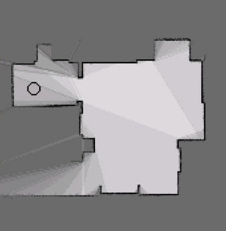
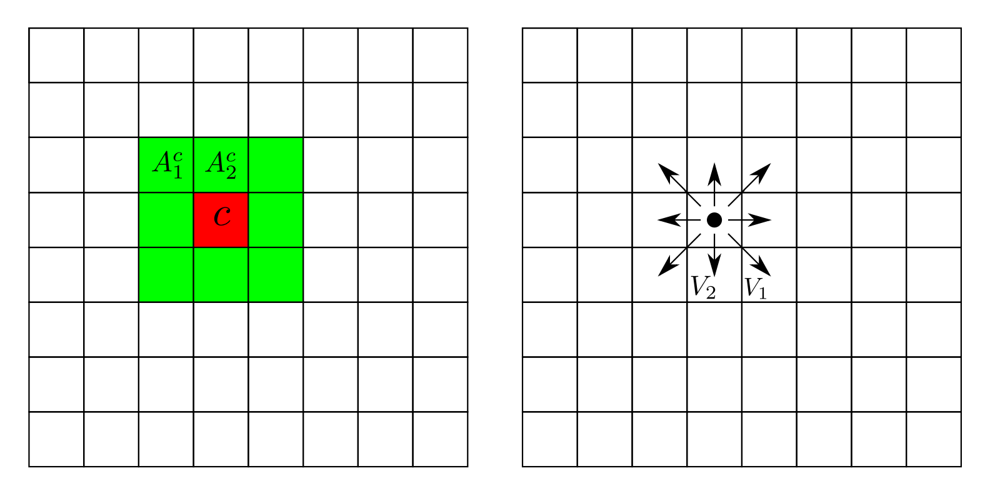
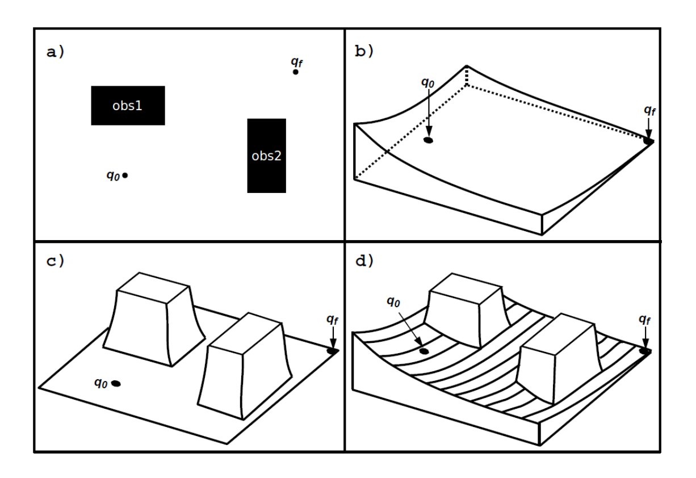
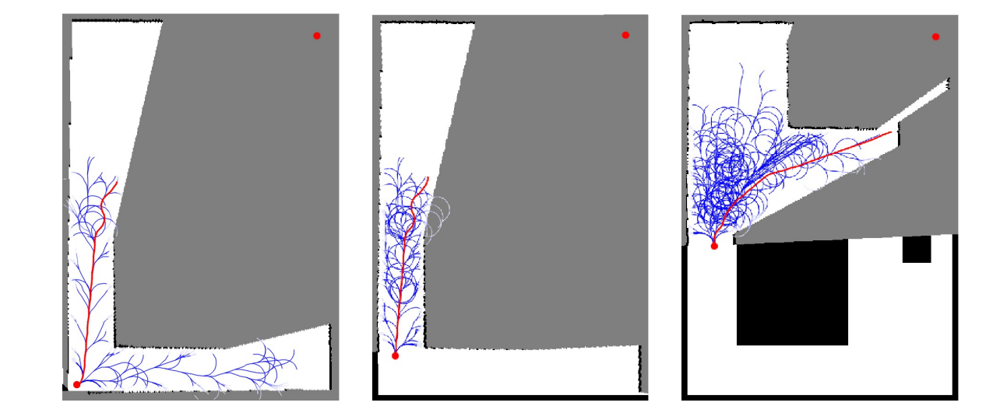

Navigation dans une foule
=========================

L'un des aspects principaux d'un robot de service est sa capacité à naviguer dans son environnement. Le processus de
navigation est un processus complexe, en effet un robot ne connaît qu'une partie de son environnement grâce à ses
capteurs. [@lobo_sensors_2006] décrit en détail les avantages et inconvénients des capteurs qui existent. Bien que ce ne
soit pas le centre de cette étude, retenons que les plus couramment utilisées sont les LIDARs (*laser imaging detection
and ranging*, LIDAR) par leurs efficacité.

En plus de la connaissance partielle de l'environnement, pour obtenir une navigation de qualité, il est nécessaire de
prendre en compte le contexte dans lequel le robot se place, en effet la navigation dans un environnement statique comme
un entrepôt vide de gens, ou dans un environnement dynamique connu, comme un entrepôt occupé uniquement par des robots
sont des problèmes différents par rapport à la navigation dans un lieu public. Cet environnement est à la fois dynamique
et incertain, cette proposition contribue à complexifier le problème. En effet, des techniques qui se basent sur
l'algorithme
[A\*](https://fr.wikipedia.org/wiki/Algorithme_A*#:~:text=En%20informatique%2C%20plus%20pr%C3%A9cis%C3%A9ment%20en,n%C5%93ud%20final%20tous%20deux%20donn%C3%A9s.)
pour la recherche de chemin et des lignes magnétiques ou utilisant le RFID (*radio frequency identification*,
RFID) [@xiao-long_robot_2017] ne permettent pas de correctement se déplacer dans un environnement densément peuplé.

L'objectif de cette partie est donc de répondre à la problématique suivante, comment un robot humanoïde peut-il se
déplacer dans un environnement dynamique et incertain.

Modélisation de l'environnement
-------------------------------

Dans un premier temps, avant de pouvoir naviguer quelque part, il est courant de permettre au robot de connaître son
environnement à l'aide d'une modélisation de ce dernier. La construction de modèles d'environnements dynamiques et
peuplés d'humains à partir de capteurs est complexe. Les scènes sont dynamiques, les conditions d'éclairage variables et
les situations possibles nous empêchent de pré-calculer toutes les solutions. La plupart des modélisations existantes
utilisent des grilles d'occupation, plusieurs méthodes existent pour les grilles d'occupation, parmi ces grilles trois
sont notables comme avancé par
[@moras_grilles_nodate].

La première est la grille d'accumulation, est inspirée du principe du vote. La construction de cette dernière s'effectue
selon la manière suivante : plus une cellule est vue comme occupée, plus elle a de chances d'être occupée. Nous
retrouvons ce genre de grille dans la cartographie d'un environnement extérieur via un LIDAR. Le deuxième paradigme
utilisé est la grille d'occupation probabiliste, le formalisme probabiliste a été le premier formalisme de gestion des
incertitudes utilisé dans les grilles d'occupation. Dans ce type d'approche, le principe d'inférence bayésienne est
utilisé pour estimer la probabilité d'occupation dans cette cellule. Cette méthode permet entre autre de prendre en
compte la dynamique de l'environnement, en couplant le calcul à l'aide du théorème de Bayes avec un *Bayesian Occupancy
Filter* il est possible de déterminer non seulement l'occupation des cellules, mais aussi leur vitesse pour pouvoir
réaliser la prédiction pour chaque cellule. Autrement dit, à l'aide de cette grille, il est possible d'estimer les cases
qui sont occupées, mais aussi celles qui vont être occupées dans un futur proche. La dernière est la grille d'occupation
évidentielle, cette dernière est couteuse à cause de sa complexité calculatoire, mais peut être utilisée pour la
construction de grille d'occupation statique à partir de capteurs ultrasons décrit par
[@pagac_evidential_1998].

Parmi ces différentes modélisations, le modèle de grille probabiliste se démarque dans le cas de la robotique de
service, d'une part le calcul est simple et d'autre part elle permet de décrire des environnement dynamiques.
Attardons-nous sur sa mise en place.

Soit l'état d'une cellule parmi deux possibilités exclusives, occupé $O$ ou libre $F$. Chaque cellule de la grille
d'occupation $G_{ij}^O$ contient une probabilité d'occupation : $I_{ij}^O = P_{ij}(O)$. Nous pouvons aussi définir la
probabilité que la cellule ne soit pas occupée $P_{ij}(F)$. Ces probabilités vérifient $\forall G_{ij}^O \in G^O, P(O) +
P(F) = 1$. Dans cette approche, nous faisons l'hypothèse que toutes les cellules sont indépendantes entre elles.

Avant de décrire le fonctionnement de cette grille dans un environnement dynamique, nous allons la formaliser dans un
environnement statique. Pour chaque cellule, nous cherchons la probabilité d'occupation conditionnelle $P(O | r_{1:k})$,
où $r_{1:k} = \{r_1, r_2, ..., r_k\}$ représente l'ensemble des mesures obtenues jusqu'à cet instant $k$. D'après le
théorème de Bayes, nous pouvons obtenir une équation qui, à chaque fois qu'une mesure est disponible, permet de faire la
mise à jour de la grille $$P(O|r_{1:k}) = \dfrac{p(r_k | O)  P(O|r_{1:k-1})}{p(r_k | O) P(O|r_{1:k-1}) + p(r_k | F) P(
F|r_{1:k-1})}$$ où $p(r_t|O, r_{1:k-1})$ représente la vraisemblance de la mesure. Une fois cette probabilité obtenue il
suffit d'appliquer la règle de décision suivante pour obtenir la fonction d'occupation notée $\mathcal{O}$
$$\mathcal{O}(G_{ij}) = \begin{cases} 1 \quad \text{si} \quad P_{ij}(O) > P_{ij}(F) \\ 0 \quad \text{si} \quad P_{ij}(O)
\leq P_{ij}(F) \end{cases}$$

Cette construction d'environnement est particulièrement bien adaptée à la construction de grille statique avec plusieurs
capteurs, en effet, il est aisé de fusionner différentes grilles calculées à partir de plusieurs capteurs, les détails
calculatoires de cette fusion ne seront pas abordés dans ce document. Cependant, il faut retenir que, ce paradigme
permet de prendre en compte la vraisemblance des capteurs, de fusionner plusieurs sources d'informations, mais aussi
d'en extraire l'information utile de manière optimale. Un exemple de construction de grille probabiliste à l'aide d'un
LIDAR est présent en .

Nous avons donc un paradigme permettant de cartographier efficacement un environnement statique à l'aide de différents
capteurs, poussons maintenant ce paradigme à un environnement dynamique. Pour prendre en compte la dynamique de
l'environnement, certaines méthodes sont capables de traiter des problèmes dynamiques. Le *Bayesian Occupancy Filter*
[@bessiere_bayesian_2008], l'approche se base à la fois sur l'occupation des cellules, mais aussi leur vitesse pour
pouvoir réaliser la prédiction pour chaque celle. Dans cette approche, pour chaque cellule $c = G_{ij}^\mathcal{O}$, les
variables estimées sont $O^c_t$, l'occupation au temps $t$ de la cellule $c$ et $A_t^c$, l'antécédent au temps $t$ de la
cellule $c$. La vitesse d'une cellule $c$ prend valeur dans un ensemble discret et fini de vitesses possibles $V =
\{V_1, V_2, ..., V_n\}$, comme indiqué sur la figure . À chaque vitesse discrète $V_k$ correspond une cellule $C_j$
appartenant au voisinage de $c$, de telle sorte que la cellule $C_j$ se déplace en $c$ si elle se déplace avec une
vitesse $V_k$ durant un pas temporel.

L'objectif du BOF (*Bayesian Occupancy Filter*, BOF) est de calculer la probabilité $P(A^c_t, O^c_t | Z_t)$ ce qui peut
être implémenté selon un schéma estimateur - prédicteur. Nous passerons sous silence les outils mathématiques associés à
l'estimateur et au prédicteur. Il faut cependant retenir que le BOF est un outil puissant qui permet de propager la
grille même si nous ne disposons pas de mesure pendant une courte période. Cette méthode a cependant la contrepartie de
posséder un coût calculatoire élevé, car elle calcule toutes les hypothèses possibles suivant la zone de voisinage
considérée pour l'ensemble des vitesses.

En somme, le modèle de grille d'occupation probabiliste permet de traduire un environnement dynamique et incertain de
manière suffisante pour pouvoir être exploitable, il reste encore à étudier la planification d'une trajectoire dans cet
environnement ainsi que l'intégration des règles sociales.

Planification dans un environnement incertain
---------------------------------------------

Maintenant que nous avons vu comment avoir une représentation du monde qui nous entoure tout en tenant compte de la
fiabilité de nos capteurs ainsi que du dynamisme de l'environnement nous pouvons étudier le problème de la planification
de trajectoire. Cette planification doit évidemment tenir compte des paramètres de notre environnement et s'adapter à
des situations incertaines. Pour ce type de navigation deux approches sont possibles, les approches délibératives et les
approches réactives [@delsart_navigation_2011].

Les approches réactives consistent à calculer à chaque pas de temps
(après récupération des informations sur l'environnement fournies par les capteurs du système) le contrôle instantané à
appliquer sur les actionneurs du système. Plusieurs approches réactives existent, nous pouvons citer la navigation par
diagrammes de proximité
[@minguez_nearness_2000], la navigation basée sur les états de collisions inévitables [@martinez-gomez_collision_2009]
ou encore la navigation par champs de potentiels [@khatib_real-time_1985]. Cette dernière est l'une des plus connues et
facile à appliquer, elle consiste à considérer le robot mobile comme une particule soumise à divers champs
électromagnétiques régissant son mouvement comme le montre la

Ces approches sont intéressantes et pourraient être utilisées dans le cadre de la navigation dans un environnement tel
que le nôtre, cependant plusieurs limites apparaissent. En effet, ces modèles permettent de gérer les robots holonomes
avec des obstacles se déplaçant à vitesse constante. Une perspective serait d'étendre ces modèles pour combler ces
manques, mais nous pouvons aussi nous tourner vers d'autres méthodes de navigation : les méthodes délibératives.

Les méthodes délibératives consistent à résoudre un problème de planification de mouvement. La planification de
mouvement est la détermination a priori d'une stratégie de mouvement entre une position initiale et une position finale
du robot à partir d'une représentation de l'environnement dans lequel il évolue. Plusieurs méthodes existent dans ce
domaine, nous pouvons citer la méthode par graphes où le but est de tenter de capturer la topologie de l'espace de
recherche pour simplifier le problème à une recherche dans un graphe. Elles sont donc constituées de deux étapes :

- Construction du graphe dans l'espace de recherche approprié

- Parcours du graphe dans le but de déterminer un chemin ou une trajectoire entre les configurations initiale et finale

Le parcours du graphe s'effectue la plupart du temps en utilisant un algorithme heuristique tel que le
A\* [@hart_formal_1968]. Ce dernier est utilisé dans le but d'éviter l'exploration complète de l'espace de recherche. En
parallèle de la planification classique par exploration d'un graphe de recherche sont apparues les méthodes par arbres.
Celles-ci consistent à construire un arbre à partir de la configuration initiale du système. Cet arbre se développe
ensuite dans toutes les directions du robot et dans la totalité de l'espace de recherche. Parmi les méthodes par arbre
l'une des plus connues et utilisées sont les RRT
(*Rapidly-exploring Random Trees*, RRT). Nous allons étudier plus en profondeur les algorithmes RRT et plus
particulièrement l'une de ses variante, le *RiskRRT*.

Commençons par présenter l'algorithme RRT avant de présenter son extension. À partir d'une configuration initiale $q_0$,
l'espace de configuration du système est exploré en choisissant aléatoirement à chaque itération une nouvelle
configuration $q_{nv}$ non obstruée par les obstacles vers laquelle se diriger. La branche la plus proche de l'arbre
déjà construit est alors déterminée puis étendue en direction de $q_{nv}$. En répétant le processus, l'espace de
recherche est alors rapidement couvert, et un chemin vers toutes configurations de cet espace peut alors être facilement
déterminée s'il en existe un. Le but de la planification étant néanmoins d'atteindre une configuration finale $q_f$, le
processus essaie de déterminer un chemin liant la configuration la plus proche de l'arbre à $q_f$ après un certain
nombre d'itérations de l'expansion de l'arbre [@delsart_navigation_2011]. Le fonctionnement de cet algorithme est
illustré en

Le RiskRRT est une méthode de planification partielle conçue pour fonctionner en environnement dynamique et incertain
[@spalanzani_contribution_2015]. Cette extension de l'algorithme RRT génère des trajectoires partielles orientées vers
le but et évaluées par une probabilité de succès. L'algorithme permet de planifier une trajectoire dans des
environnements partiellement connus, incertains, dynamiques et peuplé d'humains. Nous allons maintenant présenter
l'algorithme RiskRRT. Ce dernier gère le fait que le robot ne connaît pas son environnement en totalité. L'algorithme va
alors générer des trajectoires dans les zones visibles comme le montre la , la trajectoire la mieux notée selon nos
critères est alors choisie. Le suivi de cette trajectoire est alors initié, l'algorithme étend alors l'arbre des
trajectoires en fonction des nouvelles données disponibles, si une meilleure trajectoire est trouvée, le robot
commencera à la suivre et ainsi de suite.

À ce stade l'algorithme est capable d'évoluer dans un environnement méconnu, mais il reste deux problématiques, comment
évaluer chaque trajectoire d'une part et comment éviter les obstacles mobiles d'autre part.

En effet l'évaluation des différentes trajectoires générées par le RiskRRT, lors de la recherche de trajectoire, chaque
nœud est évalué par un risque de collision. Ce risque de collision est calculé à l'aide de deux valeurs, la probabilité
que le robot entre en collision avec un obstacle statique et la probabilité que le robot entre en collision avec un
obstacle dynamique. Cette information est aisément calculable grâce à la grille d'occupation probabiliste présentée en
. *In fine* le coût dépend de la distance qui le rapproche d'un but et de son orientation par rapport à l'orientation au
but, mais aussi de sa probabilité de collision.

Il reste à traiter le cas des obstacles dynamiques dans le cadre de cet algorithme, pour cela, le RiskRRT suppose que
les obstacles dynamiques suivent des trajectoires typiques et ne sont pas des particules errant aléatoirement dans
l'espace. Les méthodes de prédiction de la position des obstacles mobiles sont variés, nous pouvons citer la prédiction
linéaire à court terme [@fulgenzi_probabilistic_2009] si le robot possède peu d'information sur l'environnement voir des
modèles à plus long terme [@govea_incremental_2007]. Ces modèles sont appris en amont et utilisés pendant l'évolution du
robot,
[@spalanzani_contribution_2015] en fait l'exemple dans la .

En somme la combinaison du calcul du coût probabiliste et la prévision des trajectoires des obstacles peut permettre de
générer des trajectoires fiables permettant de naviguer dans un environnement incertain et dynamique. La résume cet
algorithme dans un cas d'utilisation où un robot doit naviguer tout en évitant deux obstacles dynamiques.

Pour conclure cette partie, il a été présenté deux concepts fondamentaux. D'une part la modélisation du monde en tenant
compte des incertitudes des capteurs et du dynamisme de l'environnement. Cette notion a été abordée à l'aide des modèles
de grilles d'occupation et plus précisément des grilles d'occupation probabilistes. D'autre part les algorithmes de
planification de trajectoire dans un environnement dynamique ont été présenté via la division entre les algorithmes
réactifs et les algorithmes délibératifs. Un algorithme délibératif, le RiskRRT, utilisant les grilles d'occupation
probabiliste et particulièrement bien adapté à un environnement incertain et dynamique a été présenté. Une fois ces deux
méthodes posées, il est nécessaire de se poser une question fondamentale pour la suite des travaux. En effet, jusqu'à
présent, l'humain a été considéré comme un obstacle dynamique dépourvu de conscience. Cependant, cette modélisation de
l'humain est insuffisante et il est nécessaire pour la création d'un robot de service de prendre en compte les règles
sociales.

 
