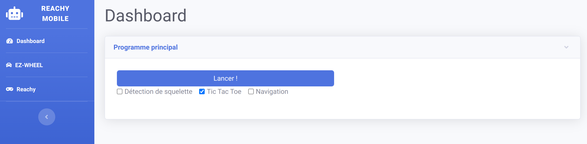

# Reachy

Dans le cadre du projet Reachy Mobile le robot Reachy a deux objectifs principaux. Détecter les utilisateurs voulant
interagir avec lui et proposer des interactions avec eux. Il doit aussi communiquer avec la base mobile Ezwheel pour
donner les ordres de déplacement.

Concernant les interactions avec les utilisateurs, le robot Reachy est principalement capable de jouer
au [Tictactoe](tictactoe.md), il peut aussi émettre des bruits et utiliser ses antennes pour transmettre des émotions.
Pour la reconnaissance d'utilisateurs vouant jouer avec lui le réseau [PoseNet](poseNet_user.md) est utilisé, permettant
de détecter les squelettes des personnes passant devant ses caméras.

Le Reachy est capable de se déplacer en étant fixé sur la base mobile Ezwheel via une plaque et un tube d'Alluminium.

## Lancement du projet

Pour lancer le projet commencez par allumer la base mobile puis le Reachy, connectez vous au Wifi de la base mobile dont
le mot de passe est `swd_starterkit`, puis allez à l'adresse `http://10.10.0.1:8000` vous accederez à la page d'accueil
du projet

Depuis cette page vous pouvez contrôler les différentes composantes du projet et lancer les différents scénarios, voir
la documentation de l'[API](reachy_dev.md) pour plus d'informations.