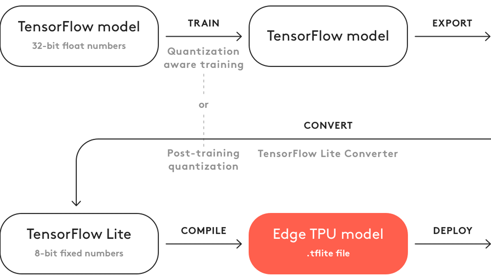

# Tictactoe

## Qu'est-ce que le jeu du Tic-tac-toe ❓  

   
Pollen Robotics, l'entreprise créatrice de robot Reachy, a crée un programme capable de souligner l'interactivité de Reachy à la fois avec les humains et lors de la saisie et du déplacement d'objets : le Tic-tac-toe.   
Le tic-tac-toe, aussi appelé « morpion » (par analogie au jeu de morpion) et « oxo » en Belgique, est un jeu de réflexion se pratiquant à deux joueurs au tour par tour dont le but est de créer un alignement de même symbole. Le jeu se joue généralement avec papier et crayon.   
Deux joueurs s'affrontent. Ils doivent remplir chacun leur tour une case de la grille avec le symbole qui leur est attribué : O ou X. Le gagnant est celui qui arrive à aligner trois symboles identiques, horizontalement, verticalement ou en diagonale.

## Jouer avec Reachy

La démo est complètement autonome : le robot ne commencera une partie que lorsque le plateau sera terminé. C'est à vous de réinitialiser la position du plateau et de remettre les pièces dans leur position de base.
Les pièces qui permettent de jouer au tictactoe (cubes et cylindres) se trouvent dans des paniers se situant sur les cotés de la grille. Dès lors que reachy vous tendra le bras et ouvrira ca pince en faisant un bruit, il vous faudra lui fournir sa pièce (cylindre) dans la pince. Il est nécessaire d'attendre la fermeture de la pince pour lacher le cylindre.   

Ensuite, si quelque chose d'étrange se produit au cours d'une partie (comme quelqu'un qui triche ou que la détection est mauvaise et donc que l'état actuel de la grille n'est pas connu) le robot baissera une de ses antennes et baleyera toutes les pièces du plateau. Il attendra ensuite le début d'une nouvelle partie, lorsque le plateau sera à nouveau nettoyé. Vous pouvez utiliser ce comportement pour réinitialiser le jeu quand vous le souhaitez.  

Lorsque le plateau est prêt, le jeu commence. Reachy désignera celui qui commence avec son bras. S'il vous montre, c'est à votre tour de commencer en plaçant une de vos pièces (cubes) sur la grille.
Une fois que vous avez joué, Reachy va analyser le plateau en baissant la tête, il lui faut un peu de temps pour tout détecter, mais une fois que c'est bon, il va prendre sa pièce et jouer à son tour. Et ainsi de suite jusqu'à ce que quelqu'un gagne.   

Lorsqu'une partie est terminée, une nouvelle partie est directement relancée. Ainsi, à la fin d'une partie, nettoyez le plateau et une nouvelle partie commencera.

## Vision

Pour le jeu de tictactoe, nous utilisons un réseau entraîné qui effectue la détection d'objets (ici la détection de cubes et de cylindres).
Le réseau est capable de détecter des formes cubiques et cylindriques de petite et grande taille, et de différentes couleurs ainsi que des cases vides. Cependant, certaines couleurs plus proches du blanc sont plus compliquées à détecter. En effet, la détection se fait par détection des bords : le réseau compare les pixels des couleurs. Donc si les pixels tirent vers le blanc il lui est difficile de faire la différence entre un pixel blanc et un pixel d'une couleur similaire.
Le réseau a était entrainé sur un jeu de train comportant : 
- un plateau à fond blanc avec grille de couleur marron 
- un plateau en bois clair avec grille de couleur marron 
- des pièces de couleurs vertes, bleues et rouges 

## Entrainement du réseau de neurones 

Pour détecter des objets dans une image, nous utilisons l'entrainement de réseaux de neurones pré-entrainé. L'entraînement avec TensorFlow permet d'effectuent un apprentissage par transfert sur un modèle de détection d'objets quantifié, puis le convertissent pour le rendre compatible avec un Edge TPU.   
Edge TPU est un petit ASIC conçu par Google qui fournit une inférence ML haute performance pour les appareils à faible consommation. Par exemple, il peut exécuter des modèles de vision mobile de pointe tels que MobileNet V2 à près de 400 FPS, de manière économe en énergie.  Sur le Reachy nous disposons du Coral USB Accelerator qui est un accessoire qui ajoute le Edge TPU en tant que coprocesseur au système existant, il peut être simplement connecté à n'importe quel système basé sur Linux avec un câble USB.   

Pour la compatibilité avec le Edge TPU, il est nécessaire d'utiliser un réseau déjà quantifié (recommandé) ou effectuer la quantification du réseau après entrainement. Dans Tensorflow 2, il n'y a pas de modèle déjà quantifié, c'est pourquoi nous avons décidé d'entrainer un réseau quantifié sur Tensorflow 1 à l'aide de l'API TOD TF1.  
Il est nécessaire de convertir le modèle entrainé (un fichier .pb) en un fichier TensorFlow Lite (un fichier .tflite), en utilisant le convertisseur TensorFlow Lite. Après avoir entraîné et converti votre modèle en TensorFlow Lite (avec quantification), l'étape finale consiste à le compiler avec le compilateur Edge TPU.

Pour plus d'informations au sujet de l'API TOD TF1 voir [ré-entrainer un réseau de neurone avec TOD TF1](https://github.com/ta18/tod_tf1).

### Jeu de données
Afin d'entrainer le réseau nous avons créée deux jeu de données : 
- un avec 173 images dont 81 images sans transformé géométriques, 77 images tourner à 20° et 15 images présentant du bruit gaussien.
- l'autre avec 96 images dont 81 images sans transformé géométriques et 15 images présentant du bruit gaussien. 

La labelisation des données se fait comme tel : labelisation des cubes, des cylindres et des cases vides. 

Exemples d'images du jeu de données :    

Nous avons effectué 3 entrainements : 
- Un entrainement avec le jeu de donnée 1. Les hyper-paramètres sont : 
    - batch size : 7 
    - nbr steps : 10 000 
- Un entrainement avec le jeu de données 1. Les hyper-paramètres sont : 
    - batch size : 5 
    - nbr de steps : 6 000 
- Un entrainement avec le jeu de donnée 2. Les hyper-paramètres sont : 
    - batch size : 7 
    - nbr de steps : 6 000 

# Stratégie de jeu 

