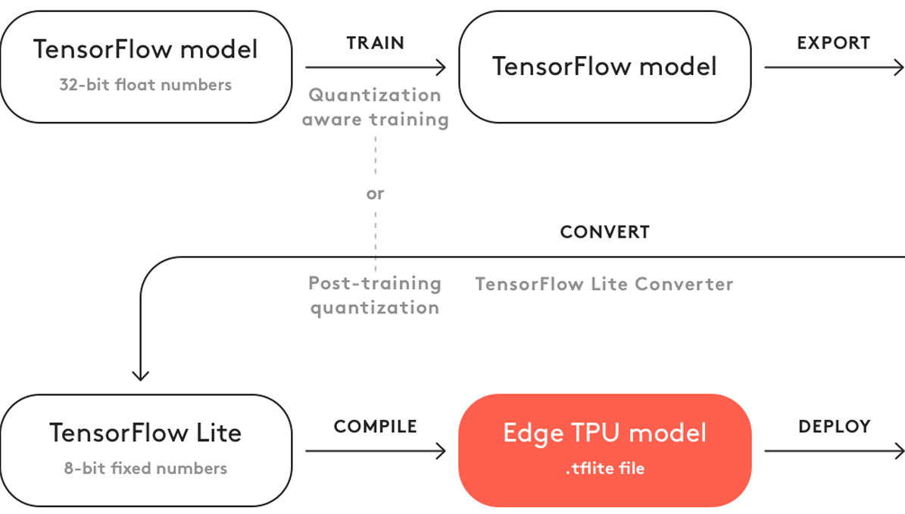
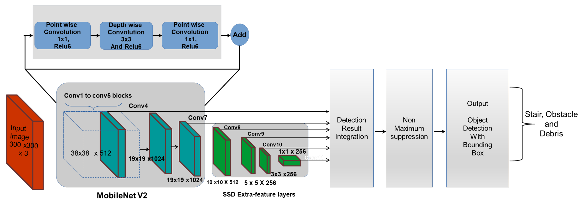
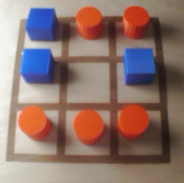
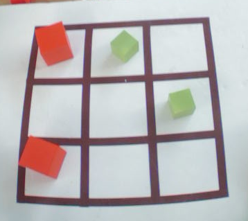
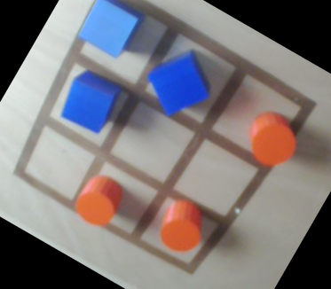
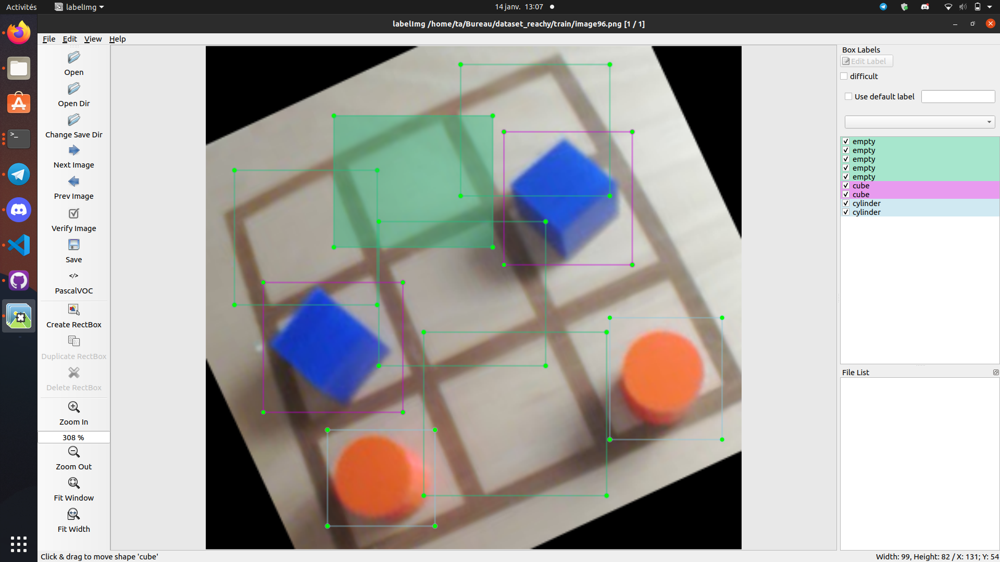
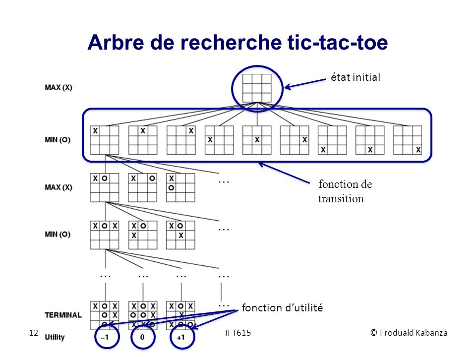

# Tictactoe

Le jeu de Tic Tac Toe sur le Reachy prend forme dans le dossier `tictactoe/reachy_tictactoe` du
dépôt `reachy_mobile_reachy`. Dans ce dossier plusieurs dossier sont notables. Tout d'abord le dossier `models`
contenant les résultats de l'entrainement du réseau de neurones permettant de détecter les pièces sur le plateau. Les
dossiers `moves-*` contiennent l'enregistrement des mouvements des bras pour poser les pièces sur le plateau. Finalement les différents fichier Python permettant de réaliser le jeu. Parmis eux plusieurs sont remarquables : 
- `game_launcher.py` : ce fichier permet de définir la boucle de jeu
- `tictactoe_playground.py` : ce fichier définit le terrain de jeu ainsi que l'analyse de ce dernier
- `rl_agent.py` : ce fichier permet de définir l'agent qui va jouer le jeu via un minimax

## Vision

Pour le jeu de tictactoe, nous utilisons un réseau entraîné qui effectue la détection d'objets (ici la détection de
cubes et de cylindres). Le réseau est capable de détecter des formes cubiques et cylindriques de petite et grande
taille, et de différentes couleurs ainsi que des cases vides. Cependant, certaines couleurs plus proches du blanc sont
plus compliquées à détecter. En effet, la détection se fait par détection des bords : le réseau compare les pixels des
couleurs. Donc si les pixels tirent vers le blanc il lui est difficile de faire la différence entre un pixel blanc et un
pixel d'une couleur similaire. Le réseau a était entrainé sur un jeu de train comportant :

- un plateau à fond blanc avec grille de couleur marron
- un plateau en bois clair avec grille de couleur marron
- des pièces de couleurs vertes, bleues et rouges

## Entrainement du réseau de neurones

Pour détecter des objets dans une image, nous utilisons l'entrainement de réseaux de neurones pré-entrainé.
L'entraînement avec TensorFlow permet d'effectuent un apprentissage par transfert sur un modèle de détection d'objets
quantifié, puis le convertissent pour le rendre compatible avec un Edge TPU.   
Edge TPU est un petit ASIC conçu par Google qui fournit une inférence ML haute performance pour les appareils à faible
consommation. Par exemple, il peut exécuter des modèles de vision mobile de pointe tels que MobileNet V2 à près de 400
FPS, de manière économe en énergie. Sur le Reachy nous disposons du Coral USB Accelerator qui est un accessoire qui
ajoute le Edge TPU en tant que coprocesseur au système existant, il peut être simplement connecté à n'importe quel
système basé sur Linux avec un câble USB.

Pour la compatibilité avec le Edge TPU, il est nécessaire d'utiliser un réseau déjà quantifié (recommandé) ou effectuer
la quantification du réseau après entrainement. Dans Tensorflow 2, il n'y a pas de modèle déjà quantifié, c'est pourquoi
nous avons décidé d'entrainer un réseau quantifié sur Tensorflow 1 à l'aide de l'API TOD TF1.  
Il est nécessaire de convertir le modèle entrainé (un fichier .pb) en un fichier TensorFlow Lite (un fichier .tflite),
en utilisant le convertisseur TensorFlow Lite. Après avoir entraîné et converti votre modèle en TensorFlow Lite (avec
quantification), l'étape finale consiste à le compiler avec le compilateur Edge TPU.

Pour plus d'informations au sujet de l'API TOD TF1 et son installation voir [ré-entrainer un réseau de neurone avec TOD TF1](https://github.com/ta18/tod_tf1).

### le réseau SSDmobilnetV2

Nous utilisons le réseau de neurones SSD MobilenetV2 qui effectue de la détection d'objet dans une image. Les réseaux
R-CNN sont des réseaux qui contiennent des couches de neurones convolutionnels (Region with Convolutional Neural
Networks, R-CNN). Les réseaux R-CNN sont des algorithmes de détection d’objet qui segmentent l’image d’entrée pour
trouver des zones délimitantes pertinentes, puis appliquent un algorithme de classification pour trouver les objets les
plus probables d’apparaître dans ces zones. Le réseaux de neurones mobilNet fait partie de la famille des réseaux de
neurones convolutionnel (Convolution Neural Network ou CNN). L'algorithme SSD est un algorithme de localisation qui
permet d’identifier toutes les zones qui représentent un élément à classifier. Couplé avec le réseau convolutionnel
mobinel V2 qui permet de faire de la classification sur ces zones d'intéret, il permet de créer le SSD Mobinel V2 qui
effectue de la détection d'objets dans une image avec boites englobantes.

L’architecture des MobileNet est une architecture composée de 28 couches dont 13 Depthwise Convolutionet 13 Pointwise
ConvolutionLes réseaux MobilNet-V2 et Mobilnet-V3 obtiennent de meilleures performancesqu’un réseau Mask R-CNN,qui est
le réseau généralement utilisé pour la détection d’objet. La séparation de la convolution en deux temps permet une
économie de calculs, un allègement de la mémoire. Ces optimisations ont également un bénéfice sur le temps de réponse et
sur la consommation énergétique, tout en ayant un faible impact sur la précision, rendant son utilisation adaptée aux
systèmes embarqués.

### Jeu de données

Afin d'entrainer le réseau nous avons créée deux jeu de données :

- un avec 173 images dont 81 images sans transformé géométriques, 77 images tourner à 20° et 15 images présentant du
  bruit gaussien.
- l'autre avec 96 images dont 81 images sans transformé géométriques et 15 images présentant du bruit gaussien.

La labelisation des données se fait comme tel : labelisation des cubes, des cylindres et des cases vides.

Exemples d'images du jeu de données :     
  
  

Nous avons effectué 3 entrainements :

- Un entrainement avec le jeu de donnée 1. Les hyper-paramètres sont :
    - batch size : 7
    - nbr steps : 10 000
- Un entrainement avec le jeu de données 1. Les hyper-paramètres sont :
    - batch size : 5
    - nbr de steps : 6 000
- Un entrainement avec le jeu de donnée 2. Les hyper-paramètres sont :
    - batch size : 7
    - nbr de steps : 6 000

Le réseau entrainé retenu est issu du dernier entrainement. En effet, nous avons supprimé les images avec rotation du
jeu de données car elle reflète une configuration qui arrive très rarement et l'entrainement sur ces données ajoute un
biai. Les images avec rotation sont difficillement labelisable : les cases vides ne peuvent pas être entourées
correctement car la labelisation se fait a l'aide de carrée.   
 Sur cette image les cases vides sont donc mal labelisées.

Un test sur le réseau de neurones à était effectuer sur 99 cubes, 93 cylindres et 120 cases vides. Ce réseau de
détection d"objet obtient les résultats suivants :

- Précision sur les cubes : 100%
- Précision sur les cylindres : 100%
- Précision sur les cases vides : 98,45%

La confiance moyenne dans la détection pour :

- les cubes est de : 87,65%
- les cylindres est de : 89,09%
- les cases vides est de : 86,82%

Le modèle entrainé qui est un fichier .tflite est présent dans `reachy_mobile_reachy/tictactoe/reachy_tictactoe/models`. Il doit être accompagné du fichier label.txt. 

# Stratégie de jeu

Pour déterminer les actions du Reachy, et les possibles cases vides ou il peut jouer le meilleur coup nous avons utilisé
l'algorithme du min-max.

Le premier principe de l’algorithme min-max est de déployer l’arbre de jeu et d’attribuer une note aux situations
atteintes à la fin de l’arbre : les feuilles de l’arbre. Cette note doit refléter la qualité de la situation. Elle doit
donc être croissante avec la qualité de la situation : meilleure est la situation, plus haute est la note. On appelle
fonction d’évaluation la fonction d’attribution de la note à une situation. La note attribuée correspond au gain espéré
si l’on atteint cette situation.

Puisque seul le gain final nous intéresse, ce sont bien uniquement aux situations positionnées en feuille de l’arbre
qu’est appliquée la fonction d’évaluation. Le problème qui se pose maintenant est de déterminer comment utiliser ces
valeurs positionnées sur les situations feuilles de l’arbre de jeu.

Le second principe de l’algorithme min-max est de propager vers le haut de l’arbre les valeurs qui ont été attribuées
aux situations feuilles afin d’attribuer, par propagation, une note aux autres situations présentes au sein de l’arbre
de jeu jusqu’à la situation innitiale située à la racine de l’arbre. L’objectif du joueur est donc maintenant
d’attribuer une note aux situations.
