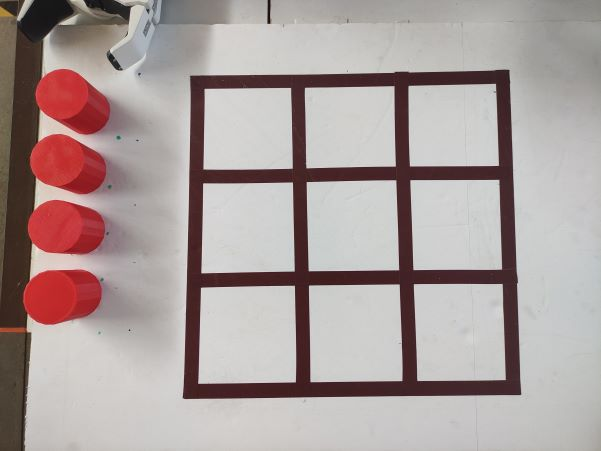
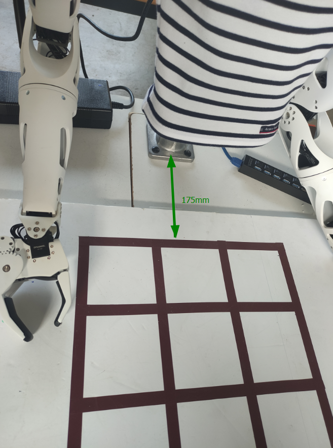
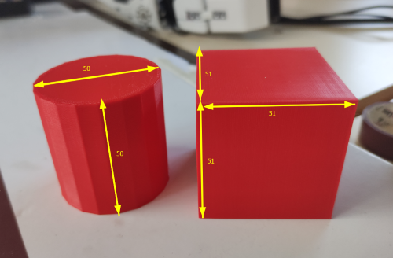
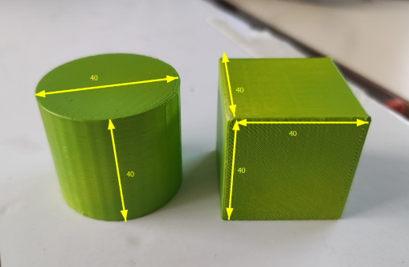
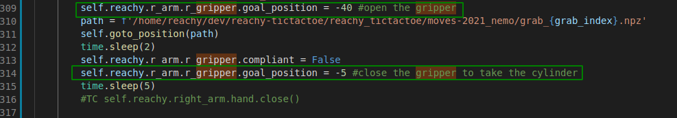
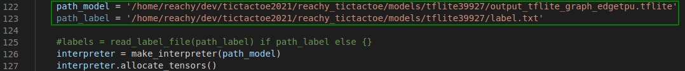

# tictactoe2021

## 📗 Documentation

The information in this file is taken from the following links :   
[Tic-tac-toe game](https://fr.wikipedia.org/wiki/Tic-tac-toe)   
[Playground configuration](https://www.notion.so/TicTacToe-Guide-26937009c5dc4a7f950ede22c918d85a)  
[Reachy 2019 Documentation](https://pollen-robotics.github.io/reachy-2019-docs/)  
[Reachy 2021 Documentation](https://docs.pollen-robotics.com/)


## What is Tic-tac-toe game ❓ 
   
Pollen Robotics, the company that created Reachy, has created a program capable of underlining Reachy's interactivity by grasping and moving objects: the Tic-tac-toe game.   
Tic-tac-toe, also called "morpion" in France or "oxo" in Belgium, is a two-player turn-based game. The game is usually played with paper and pencil.   
Two players compete against each other. Each of them will take a turn to place a cross or a circle at a place on the grid. The winner is the one who manages to align three identical symbols, horizontally, vertically or diagonally.  

## Job done 
  
During the migration of the robot from SDK 2019 to SDK 2021, a lot of commands have changed and made it impossible to run the Tic-tac-toe game on Reachy 2021. 
So I have adapted the code for Reachy 2021 especially on some significant changes such as :    
* `reachy.r_arm.shoulder_pitch` : the *right_arm* attribute of the reachy object change to *r_arm*. This leads to a change in all the code at the level of the robot's movements. 

* The method of the reachy object `goto()` becomes an external function :   
Instead of doing this :  
```python
reachy.right_arm.elbow_pitch.goto(
    goal_position=90,  # in degrees
    duration=2,  # in seconds
    wait=True,
)
```
He doing this :
```python
goto(
	goal_positions={reachy.r_arm.r_elbow_pitch: -90,}
	duration=1.0,
	interpolation_mode=InterpolationMode.MINIMUM_JERK
	)
```

* Now, we use the method turn_on() to put non compliant a whole system of reachy :     
`reachy.turn_on('r_arm')`   

## Configuration  

To make the game work, a particular configuration is necessary :    
* to have at least one right arm on Reachy to move the pieces  
* to have a head with cameras to be able to watch and analyze the playground   

To set up the Tic-tac-toe you will need : 
- A reachy robot with the configuration stated above. 
- A playground composed of : a wooden or cork board (the material of your choice), 5 cylinders, 5 cubes and black or brown tape.    

### Setup the playground 

To be able to play tic-tac-toe with Reachy you will first have to build a suitable playground :    

For this you need a **45 x 65 board made of wood, cork, featherboard** ... etc. The dimensions are [here](https://www.notion.so/Dimensions-setup-morpion-a032f56eb2f14702a75a1bb347bbd2dd).

1. On your board, you have to place the chaterton like this to create your grid :    
   

2. Place the board at 175 mm from the foot of the Reachy. I advise you to fix the board well so that the robot does not move it while playing.    
   

3. The size of the pieces is variable, I trained my neural network on big and small pieces. I advise the following sizes :    
     

You can find STL for 3D printing these parts [here](https://github.com/ta18/tictactoe2021/blob/main/playground)             
You will need 5 pieces of each.   
By default, Reachy can play with big pieces, if you want to play with small pieces you have to modify some line on code (cf section "Adapting Reachy's game to his environment"). 

### First start-up :   

1. Turn on the robot.   
2. Clone the repository : `cd ~/dev && git clone https://github.com/ta18/reachy-tictactoe_2021`
3. Install sklearn : `pip3 install sklearn zzlog`
4. Install the service on Reachy : 
```
sudo cp /home/reachy/dev/reachy-tictactoe_2021/tictactoe_launcher.service /etc/systemd/system
sudo systemctl daemon-reload 
sudo systemctl enable tictactoe_launcher.service
```
The output must be : `Created symlink /etc/systemd/system/multi-user.target.wants/tictactoe_launcher.service → /etc/systemd/system/tictactoe_launcher.service.`    
5. Restart the robot.     
6. Wait for 30 seconds, the program will start itself and Reachy will start playing.    

### systemctl utilisation  

Commannds to know : 
* `sudo systemctl stop tictactoe_launcher.service` : it will stop the service 
* `sudo systemctl start tictactoe_launcher.service` : it will stop the service and the game
* `sudo systemctl status tictactoe_launcher.service` : it will give you the state of your service, for exemple if they are some mistakes  

## Playing with Reachy 

The demo is completely autonomous :   
The robot will only start a game once the board is finished. It is up to you to reset the board position and to put the pieces back to their basic positions.   
The **basic position** it's : 
- a grid without game pieces  
- the reachy's pieces (cylinder) to the left of the board 

When a game is over, a new one is directly restarted. So, at the end of a game, clean the board and a new game will start.   

Then, if something strange happens during a game (like someone cheating, the detection was wrong so we don't know our current state, etc.), the robot will reset the game. It will moove one of his antenna and knock over all the pieces on the board. It will then wait for a new game to start, when the board is cleaned up again. You can use this behavior to reset the game whenever you want.   

When the board is ready, the game start. Reachy will point to the one who starts with his arm. If he shows you, it's your turn to start the game by placing one of your pieces (cubes).    
Once you have played, Reachy will analyze the board by lowering his head, it takes him a little time to detect everything, but once this is good, he will take his piece and play in turn.   
And so on until someone wins.    

## Adapting Reachy's game to his environment

Reachy is a robot that can perform many actions, but each robot and its environment is different: some motors may be tired, your playground may not be the same ... etc. If you want to go further and look at what is going on in the code, to change some parameters, here are the things that can be changed: 

You can find 3 notebooks in the repository :     
* Collect_training_images.ipynb  
* record_movements.ipynb   
* test_formDetection_tf1.ipynb  

#### Adapt the mouvements
If you want to **adapt the movements of the Reachy during the tictactoe**, you can use the notebook *record_movements.ipynb* which allows you to record the movements such as the movements to put the pieces on the different squares.     

#### Adapt the opening of the gripper 
**If you use the small pieces** you will have to modify the gripper closure to allow Reachy to take a piece. To do this, you have to modify the file *tictactoe_playground.py* which is in /home/reachy/dev/tictactoe2021/reachy_tictactoe :       
       
line: open gripper     
line: closed gripper     
line: open gripper     

#### Check the object detection 
To check that the robot take a picture of the whole grid, use the notebook *test_formDetection_tf1.ipynb*.     
For all the object detection mistake, see the section "Re-training a model".     

## Re-train a model 

For the tictactoe game, I use a trained network that performs object detection (here cube and cylinder detection).    
The network is able to detect cubic and cylindrical shapes of small and large size, and of different colors and also empty boxes. However, some colors that are closer to white are more complicated to detect. Indeed, the detection is done through edge detection: the network compares the pixels of colors. So if the pixels pull towards the white it is difficult for him to make the difference between a white pixel and a pixel of a similar color.    
If you want to use the network I trained, you can use small and large pieces, but I advise you to take colors that are closer to blue, red or dark green.   
Also I used a white playground to train my layout, so if you use a brown, black or any other color playground you may have to re-train the layout.   

The configuration that I recommend to avoid re-training the network is the following :    
- blue, red or dark green playground   
- white playground   
- black or brown grid   

If you want to re-train the network you will have to follow the following tutorial :    
[Retrain a SSH mobilnet model with Tensorflow 1 for EdgeTPU](https://github.com/ta18/tod_tf1)

When your model is retrain you have to put the output_tflite_graph_edgetpu.tflite and the label.txt file in /home/reachy/dev/tictactoe2021/reachy_tictactoe/models and change the path_model variable in *vision.py* : 
     
